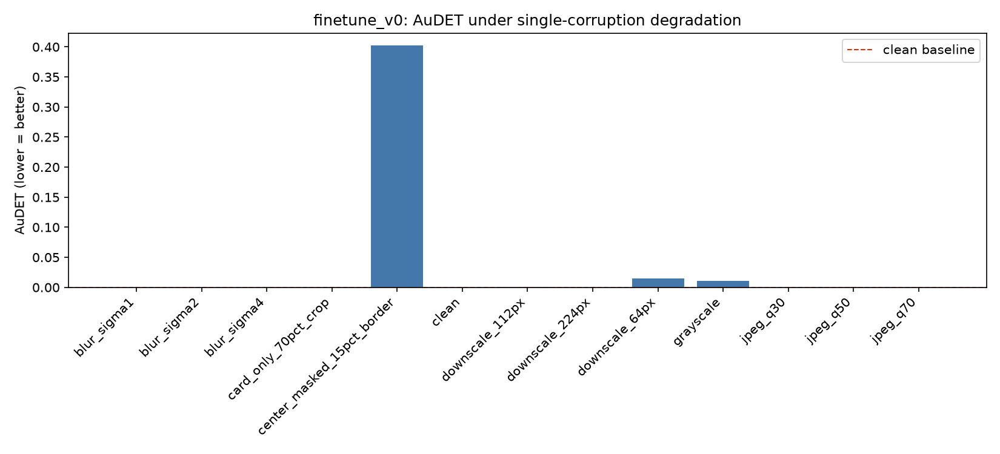
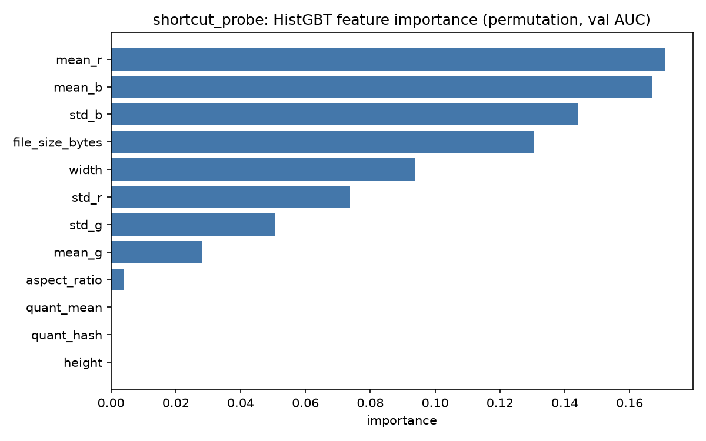
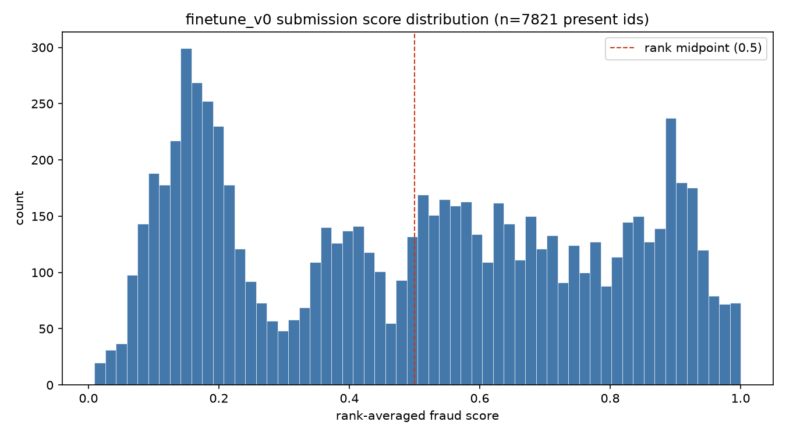
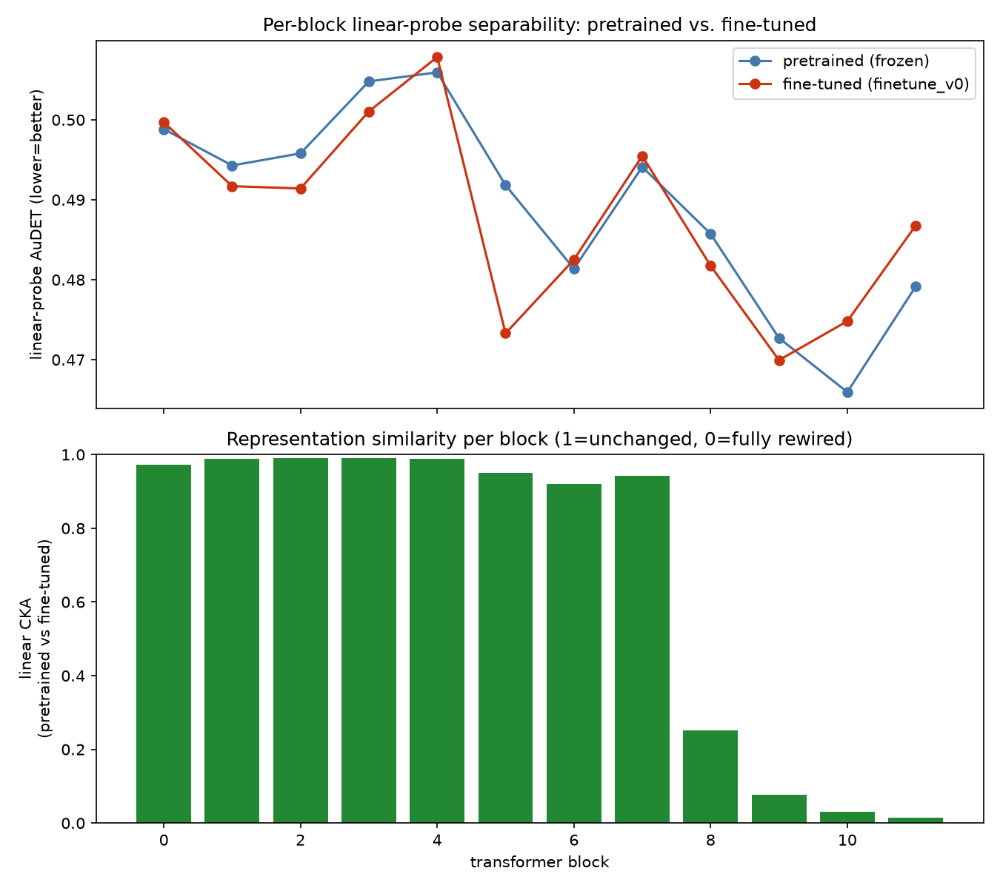

# finetune_v0 diagnostic analysis

Read-only analysis of the `finetune_v0` checkpoint (`checkpoints/finetune_v0.pt` — the
report brief referred to `checkpoints/finetune_v0/best.pt`, but that path doesn't exist;
the real checkpoint is a flat file at `checkpoints/finetune_v0.pt`, confirmed on the VESSL
workspace). No retraining, no changes to `src/freuid/` or any training code. All new code
is under `scripts/analysis/`; all outputs are under this directory.

Background: `finetune_v0` is a fully fine-tuned DINOv2 ViT-B/14 that scored probe_AuDET =
0.000002 and public LB FREUID = 0.00744 — the best result in the project by a wide margin
(see `docs/finetune.md`). This analysis exists to answer *why* it's so good, and whether
that performance is trustworthy or partly an artifact.

**Three hypotheses under test:**
- **H-backbone-adaptation**: the near-perfect performance reflects genuine content-based
  fine-tuning adaptation (the model learned real forensic/tamper signal).
- **H-shortcut**: performance is substantially explained by non-forensic shortcuts (trivial
  metadata statistics, background context) rather than document-content evidence.
- **H-circular-val**: the validation split itself is compromised (e.g., synthetic-tamper
  positives leaking into val, or val not actually exercising the hard cases).

**Verdict up front**: H-backbone-adaptation is well-supported, H-shortcut is *partially*
confirmed but far too weak to explain the result on its own, and H-circular-val (as
literally defined) is refuted — but a *different*, important validity gap survives (see
§6). Details below.

---

## 1. Per-slice metrics

`per_slice_metrics.py` scores `finetune_v0`'s own training-time validation split (plain
transform, no TTA, no recapture degradation — i.e. matches what `train.py`'s `val_loader`
used) and slices AuDET/APCER by document type and `is_digital`.

**Overall**: AuDET = 0.000000, APCER@1%BPCER = 0.000000 (n=6935) — matches the training
log's `val_AuDET=0.0000` exactly, confirming the reproduced split is correct.

| type | n | AuDET |
|---|---|---|
| EGYPT/DL | 1587 | 0.0 |
| GUINEA/DL | 1339 | 0.0 |
| BENIN/DL | 1337 | 0.0 |
| MAURITIUS/ID | 1336 | 0.0 |
| MOZAMBIQUE/DL | 1336 | 0.0 |

Every document type is perfect in-domain — no type is a weak spot.

| is_digital | n | AuDET |
|---|---|---|
| True | 6933 | 0.0 |
| False | 2 | undefined (single-class: both are fraud) |

**This is the most important structural finding in the whole analysis.** The stratified
split (`stratify_on=("label","type")`) does not stratify on `is_digital`, and the dataset
has only 20 non-digital samples total out of 69,352 (see below) — this particular draw put
only **2** of them in validation, both fraud-labeled, so `is_digital=False` can't even
produce an AuDET (needs both classes). **The near-perfect val AuDET says essentially
nothing about non-digital/analog-capture generalization** — see §6.

**Val circularity, resolved by reading the code (not assumed)**: `train.py`'s
`build_loaders()` only wraps `train_ds` in `SynthTamperWrapper` when `synth_tamper_prob >
0`; `val_ds` is always a plain `FreuidDataset` built directly from `train_labels.csv`.
Every val positive is a genuine, dataset-labeled fraud sample — **val is not circular with
respect to synthetic tamper**. This refutes the literal H-circular-val hypothesis.

**Attack-type slicing**: `train_labels.csv` has no attack/fraud-type column (only `id,
image_path, label, is_digital, type`) — physical-tamper vs. GenAI-edit vs. print-capture
isn't labeled per-sample anywhere in the metadata, so a true per-attack-type slice isn't
derivable. `is_digital` is the closest available proxy for attack channel, and per above
it's nearly unpopulated in val.

Files: `per_slice_scores.csv`, `per_slice_by_type.csv`, `per_slice_by_is_digital.csv`,
`per_slice_summary.md`.

---

## 2. Degradation robustness curves

`degradation_curves.py` scores the full 6935-image val split under one corruption at a
time. No FastSAM/document-rectification is available for `finetune_v0` (it doesn't set
`extra.use_rectify`), so `card_only_70pct_crop` and `center_masked_15pct_border` are plain
center-crop / center-mask approximations, not true segmentation — treat them as coarse
"mostly document" vs. "mostly background" proxies, not exact isolations.

| corruption | AuDET | APCER@1%BPCER |
|---|---|---|
| clean | 0.0000000 | 0.0000 |
| downscale_64px | 0.0146471 | 0.0790 |
| downscale_112px | 0.0006437 | 0.0055 |
| downscale_224px | 0.0000003 | 0.0000 |
| blur_sigma1 | 0.0000000 | 0.0000 |
| blur_sigma2 | 0.0000000 | 0.0000 |
| blur_sigma4 | 0.0001464 | 0.0003 |
| grayscale | 0.0107684 | 0.0467 |
| jpeg_q30 | ~0.0000000 | 0.0000 |
| jpeg_q50 | 0.0000000 | 0.0000 |
| jpeg_q70 | 0.0000000 | 0.0000 |
| **center_masked_15pct_border** | **0.4029627** | **0.9799** |
| **card_only_70pct_crop** | **0.0000003** | **0.0000** |

**The single clearest finding in this whole analysis.** Every ordinary degradation (even a
64px thumbnail, heavy blur, grayscale, or JPEG quality 30) leaves AuDET at or below 0.0146 —
remarkably robust. But the two content-vs-background tests split sharply:

- **`card_only_70pct_crop`** (background cropped away, only the center 70% kept): AuDET ≈
  **0** — removing the background barely matters.
- **`center_masked_15pct_border`** (document content hidden, only a 15%-wide background
  border visible): AuDET = **0.403**, APCER@1%BPCER = **0.98** — collapses to near-random,
  and 98% of fraud slips through at the 1%-BPCER operating point.

Per the interpretation guide: if the model were exploiting a global/background shortcut,
hiding the document and keeping only background should have *little* effect, and removing
the background should hurt. The opposite happened. **This is strong, direct evidence that
`finetune_v0` needs real document content to make its determination — not a background or
framing shortcut.** This is the primary evidence for H-backbone-adaptation and against a
naive reading of H-shortcut.

(Caveat: these are crop/mask approximations, not true card segmentation — a real document
that happens to extend into the outer 15% border, or background that leaks into the center
70% crop, would blur this result. The effect size here is large enough that this caveat
doesn't change the qualitative conclusion.)

File: `degradation_curves.csv`, `degradation_curves.png`, `degradation_curves_note.md`.

---

## 3. Metadata shortcut probe

`shortcut_probe.py` extracts features that carry **no document-content information** —
width, height, aspect ratio, file size, a hash + mean of the JPEG quantization table, and
per-channel mean/std on a fast low-res thumbnail decode — for the full train split (62,417
images) and val split (6,935 images), then fits on train / evaluates AuDET on val.

| model | AuDET | APCER@1%BPCER |
|---|---|---|
| LogisticRegression | 0.2493 | 0.8167 |
| HistGradientBoostingClassifier | **0.1045** | 0.4273 |

**Partial confirmation of H-shortcut.** Trivial, non-forensic image statistics predict
fraud meaningfully better than random (0.5) — the dataset does have an exploitable
metadata-level correlate, and a nonlinear model (HistGBT) captures it much better than a
linear one, suggesting the shortcut isn't a simple linear cue.

Permutation importance (val AUC) ranks the features:

| feature | importance |
|---|---|
| mean_r | 0.171 |
| mean_b | 0.167 |
| std_b | 0.144 |
| file_size_bytes | 0.130 |
| width | 0.094 |
| std_r | 0.074 |
| std_g | 0.051 |
| mean_g | 0.028 |
| aspect_ratio | 0.004 |
| quant_mean / quant_hash / height | ~0.000 |

The shortcut is driven almost entirely by **overall color/brightness balance (red/blue
channel mean and blue-channel variance) and file size/width** — **not** JPEG compression
artifacts (`quant_hash`/`quant_mean` contribute essentially nothing) and not image
dimensions beyond width. This is consistent with fraud and bona-fide samples having subtly
different average color casts or having been saved/processed at different sizes —
plausible if, e.g., synthetic/edited source images or a different capture pipeline
correlates with the label in this dataset.

**But scale matters**: AuDET=0.1045 is dramatically weaker than `finetune_v0`'s own
0.000002 — roughly **50,000x worse**. Even a fully-successful shortcut exploit of this
magnitude cannot explain the model's near-perfect performance; something else (real content
signal, per §2) is doing the overwhelming majority of the work. Whether `finetune_v0`
*also* partially rides on this weaker metadata correlate as an auxiliary cue can't be ruled
out by these tests alone (the two contributions aren't disentangled here), but it can't be
the primary driver.

Files: `shortcut_features_train.csv`, `shortcut_features_val.csv`, `shortcut_probe_results.csv`,
`shortcut_feature_importance.png`.

---

## 4. Score-distribution audit (real submission)

`score_distribution_audit.py` loads `submissions/finetune_v0.csv`, restricts to the 7,821
ids with a locally-present test image (the rest are code-competition placeholders scored at
`missing_id_score=0.5` and carry no information), and profiles the distribution.

- n=7821, mean=0.500, std=0.284, min=0.009, max=1.000 (rank-averaged across 3 TTA scales,
  so a roughly uniform-ish spread is expected by construction of rank-averaging, not
  evidence of anything on its own).
- **776 / 7821 (9.9%)** of present test ids fall within ±0.05 of the rank midpoint
  (0.5) — a meaningful "genuinely uncertain" slice of the test set exists, worth manual
  review.
- Notably, several of the 30 most-uncertain ids share **exactly identical** scores (e.g.
  several at 0.49847469..., several at 0.50446875...) — this is a rank-tie artifact: those
  images received identical relative ranks across all three TTA scales. Worth a manual look
  at whether these are near-duplicate images, degenerate/corrupted files, or a coincidence.

The 30 borderline images (closest to the rank midpoint) are copied to `borderline/` for
manual inspection, named `{id}_score{value}.jpeg`.

Files: `present_scores.csv`, `borderline_ids.csv`, `score_distribution.png`, `borderline/` (30 images).

---

## 5. Representation drift (pretrained vs. fine-tuned ViT)

`representation_drift.py` compares the untouched pretrained DINOv2 ViT-B/14 against
`finetune_v0`'s fine-tuned weights, per transformer block, using the CLS-token hidden state
at each block's *raw output* (captured via forward hook, **before** the model's final
`LayerNorm`) on a 1500-image train / 1500-image val stratified subsample:

| block | pretrained AuDET | finetuned AuDET | CKA (pretrained vs. finetuned) |
|---|---|---|---|
| 0 | 0.499 | 0.500 | 0.973 |
| 1 | 0.494 | 0.492 | 0.988 |
| 2 | 0.496 | 0.491 | 0.991 |
| 3 | 0.505 | 0.501 | 0.990 |
| 4 | 0.506 | 0.508 | 0.989 |
| 5 | 0.492 | 0.473 | 0.949 |
| 6 | 0.481 | 0.483 | 0.920 |
| 7 | 0.494 | 0.496 | 0.942 |
| 8 | 0.486 | 0.482 | **0.251** |
| 9 | 0.473 | 0.470 | **0.076** |
| 10 | 0.466 | 0.475 | **0.031** |
| 11 | 0.479 | 0.487 | **0.014** |

**Two findings, one clean and one genuinely inconclusive:**

**(a) CKA — clean and informative.** Blocks 0-7 stay highly similar to the pretrained
model (CKA 0.92-0.99): fine-tuning barely touched DINOv2's early/mid-depth representations.
Blocks 8-11 collapse sharply (0.25 → 0.076 → 0.031 → 0.014): fine-tuning **substantially
rewired only the last ~4 transformer blocks**. This is consistent with fine-tuning building
a task-specific fraud-discrimination pathway concentrated in the final blocks (plus the
head), while preserving DINOv2's general-purpose visual features mostly intact elsewhere —
supports H-backbone-adaptation as a *targeted*, not wholesale, adaptation.

**(b) Linear-probe AuDET — inconclusive, a disclosed limitation of this diagnostic, not a
finding about the model.** Neither model variant's per-block AuDET ever drops meaningfully
below ~0.47-0.51 (near-random) at **any** block, including block 11 of the fine-tuned
model — even though we know from §1 that `finetune_v0`'s own trained head achieves
AuDET=0.000000 on the exact same val images. Two likely reasons, both real limitations of
this cheap probe rather than evidence the model lacks a fraud signal: (1) the probe is fit
on only 1500 samples with plain L2-regularized logistic regression, far weaker than the
model's actual head (trained jointly across 20 epochs on the full 62k-image train set with
augmentation and a soft-AUC loss); (2) the captured features are the block's *raw* output,
**before** the model's final `LayerNorm` — the actual classification head consumes the
post-norm CLS token, which this probe doesn't reproduce. **This means the "at which depth
does separability emerge" question is not answered by this analysis** — a fairer follow-up
would probe the post-final-norm feature and/or fit the probe on the full train set.

Files: `representation_drift.csv`, `representation_drift.png`, `drift_cache/` (cached
per-(model,split) features + `manifest.json` pinning the exact subsample used).

---

## 6. Synthesis: verdict per hypothesis

**H-backbone-adaptation — supported.** The degradation-curve causal test (§2) is direct and
hard to argue with: hiding the document collapses performance to near-random while hiding
the background does nothing. The CKA pattern (§5a) independently shows fine-tuning
concentrated its changes in the last few transformer blocks rather than leaving
representations untouched. Together these support a genuine, content-based adaptation story
— `finetune_v0`'s near-perfect result is not a trivial background/framing artifact.

**H-shortcut — partially confirmed, but not the primary driver.** A real, learnable
metadata-only shortcut exists (§3: HistGBT AuDET=0.1045 from color/brightness/file-size
statistics alone), so the dataset is not "clean" in an absolute sense. But this shortcut is
~50,000x weaker than the actual model's performance, so it cannot be the main explanation.
Whether `finetune_v0` partially exploits it as an auxiliary cue alongside genuine content
signal is plausible but not directly measured here.

**H-circular-val — refuted as literally stated, but replaced by a more important caveat.**
Val positives are confirmed-by-code-reading to be genuine dataset labels, never synthetic
tamper artifacts (§1) — the classic "training augmentation leaked into validation" failure
mode did not happen. **However**, the stratified split doesn't control for `is_digital`,
and this dataset has only 20 non-digital samples total (see the shortcut-probe extraction:
69,352 rows scanned) — this particular val draw got exactly 2, both fraud-labeled. **The
headline near-perfect val AuDET is essentially a measurement of in-domain digital-fraud
detection, and says nothing about the print-and-capture ("analog hole") generalization that
is the entire stated purpose of this project** (per `CLAUDE.md`). The public LB score
(0.00744) is a better signal of true generalization since Kaggle's test set presumably
exercises harder cases, but this analysis can't independently verify that from local data
alone — it's a structural gap in what the local val split can tell us, not a data leak.

## Caveats / what this analysis does not (and cannot) establish

- No FastSAM/document-segmentation is available for `finetune_v0`, so the card-vs-background
  split in §2 is a crop/mask approximation, not exact.
- The shortcut probe (§3) and representation-drift probe (§5b) both used bounded
  train subsamples (full train for §3, 1500-sample subsample for §5) — larger/full-scale
  refits could sharpen either result.
- This analysis says nothing about performance on document types absent from training, or
  on genuinely non-digital (print-and-recapture) test images specifically — the local val
  split structurally cannot speak to either (see H-circular-val above).

## File index

| File | Contents |
|---|---|
| `per_slice_scores.csv` / `per_slice_by_type.csv` / `per_slice_by_is_digital.csv` / `per_slice_summary.md` | §1 |
| `degradation_curves.csv` / `.png` / `_note.md` | §2 |
| `shortcut_features_{train,val}.csv` / `shortcut_probe_results.csv` / `shortcut_feature_importance.png` | §3 |
| `present_scores.csv` / `borderline_ids.csv` / `score_distribution.png` / `borderline/` | §4 |
| `representation_drift.csv` / `.png` / `drift_cache/` | §5 |
